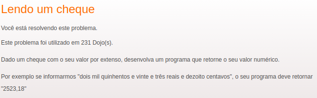

# Dojo Bank Cheque Transformer

### Description

Bank cheque transformer is an abstraction package that receives a string value until "999.999,99" and transforms it to a number.

Example:

```bash
# INPUT
'Três Mil e Quinhentos Reais'

# OUTPUT
'3500,00'
```

### Usage

Install:

```bash
$ npm i ViniciusMartinsS/dojoBankCheque -S
```

#### Example of Usage on Query Service

```js
const { convertBankCheque } = require('bankCheque')

const bankChequeDoubleValue = convertBankCheque('vinte e dois reais')
```

Response received is an object as the below example: 

```json
{
  "status": "true",
  "conversion": "22,00"
}
```

### [Dojo Puzzle](http://dojopuzzles.com/problemas/exibe/lendo-um-cheque/) 


Done by: Vinicius Simone Martins

